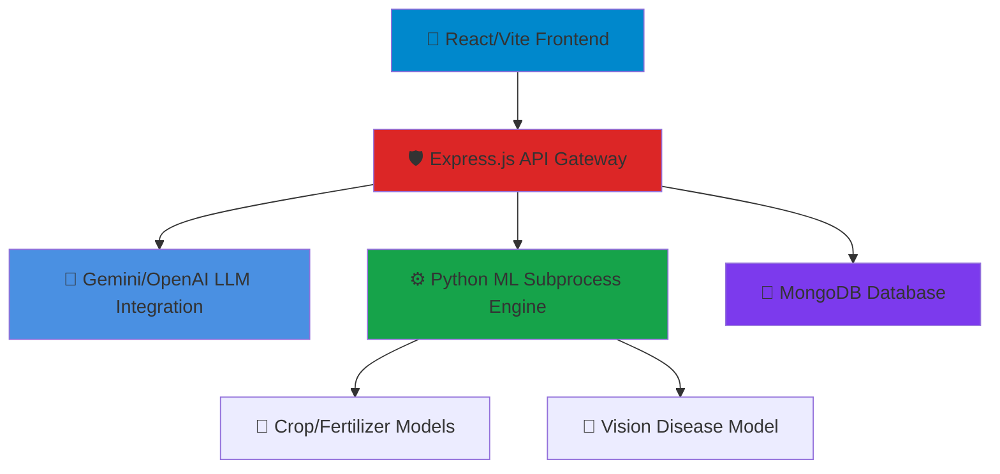

<<<<<<< HEAD
```
 █████╗  ██████╗ ██████╗ ██╗███████╗██╗  ██╗██╗███████╗██████╗     █████╗ ██╗
██╔══██╗██╔════╝ ██╔══██╗██║██╔════╝██║  ██║██║██╔════╝██╔══██╗   ██╔══██╗██║
███████║██║  ███╗██████╔╝██║███████╗███████║██║█████╗  ██║  ██║   ███████║██║
██╔══██║██║   ██║██╔══██╗██║╚════██║██╔══██║██║██╔══╝  ██║  ██║   ██╔══██║██║
██║  ██║╚██████╔╝██║  ██║██║███████║██║  ██║██║███████╗██████╔╝██╗██║  ██║██║
╚═╝  ╚═╝ ╚═════╝ ╚═╝  ╚═╝╚═╝╚══════╝╚═╝  ╚═╝╚═╝╚══════╝╚═════╝ ╚═╝╚═╝  ╚═╝╚═╝
```

## Next-Generation Intelligent Agriculture System
Predictive Analytics · Multi-Modal AI · Real-time Diagnostis

AgriShield AI is an enterprise-grade, AI-powered agricultural management system that revolutionizes farming workflows. Built on a MERN stack with advanced Python machine learning integration and Prompt Engineered LLMs (Google Gemini / OpenAI), it delivers autonomous crop recommendations, precise fertilizer guidance, and computer-vision-based disease detection.

[🚀 Quick Start](#-quick-start) · [🎯 Features](#-key-features) · [🏗️ Architecture](#%EF%B8%8F-system-architecture) · [🧠 Intelligence Pipeline](#-the-intelligence-pipeline)

---

## 📑 Table of Contents
1. [🎯 Key Features](#-key-features)
2. [🏗️ System Architecture](#%EF%B8%8F-system-architecture)
3. [🔒 The Intelligence Pipeline](#-the-intelligence-pipeline)
4. [🧠 Prompt Engineering Strategy](#-prompt-engineering-strategy)
5. [🚀 Quick Start (Docker Deployment)](#-quick-start)
6. [🛠️ Tech Stack](#%EF%B8%8F-tech-stack)

---

## 🎯 Key Features

*   **Multi-Model Machine Learning Integration:** Predictive models for crop and fertilizer recommendations based on soil NPK, pH, and environmental factors.
*   **Computer Vision Disease Detection:** Real-time leaf image analysis identifying pathogens and returning both chemical and organic treatment plans.
*   **Context-Aware AI Chatbot:** Prompt-engineered Large Language Models (LLM) offering fallback routing and intelligent contextual agriculture guidance without repetitive echoing.
*   **Enterprise Dashboard UI:** Secure JWT-based authentication, real-time weather integration, and confidence-gated historical trend charts built on React & Tailwind CSS.

---

## 🏗️ System Architecture



### Components
*   **Layer 1 (Presentation):** React 19 + Tailwind CSS + Framer Motion.
*   **Layer 2 (API Gateway):** Express.js routing, JWT Middleware, Offline Memory Fallback.
*   **Layer 3 (Intelligence):** Axios-based REST calls to Gemini 1.5 Flash / GPT-4o-mini, and `child_process` hooks to local Python ML environments.
*   **Layer 4 (Storage):** MongoDB Atlas (or local Docker volume) storing users and prediction logs.

---

## 🔒 The Intelligence Pipeline

```text
┌─────────────────────────────────────────────────────────────────┐
│                     📱 USER CHAT QUERY                          │
│        "What do yellow spots on my tomato leaves mean?"         │
└────────────────────────────┬────────────────────────────────────┘
                             │
 ╔═══════════════════════════▼═══════════════════════════════════╗
 ║              🛡️ LAYER 1 · ROUTING & VALIDATION               ║
 ║                                                               ║
 ║ ✓ API Key Verification (Gemini / OpenAI)                      ║
 ║ ✓ History Context Hydration                                   ║
 ║ ✓ Prompt Injection Mitigation                                 ║
 ╚═══════════════════════════╤═══════════════════════════════════╝
                      API KEYS PRESENT?
                   ┌─────────┴─────────┐
                 YES                   NO
                 ▼                     ▼
 ╔═════════════════════════╗ ╔═════════════════════════════════╗
 ║  🧠 LAYER 2 · LLM AI    ║ ║ ⚙️ LAYER 2 · SMART FALLBACK   ║
 ║                         ║ ║                                 ║
 ║ System Prompts Applied  ║ ║ NLP Keyword Extraction:         ║
 ║ LLM Inference Executed  ║ ║ 'tomato', 'yellow spot'         ║
 ║                         ║ ║ Mapping: Early Blight           ║
 ╚═════════════════════════╝ ╚═════════════════════════════════╝
                   └─────────┬─────────┘
                             ▼
 ╔═══════════════════════════════════════════════════════════════╗
 ║               ⚖️ LAYER 3 · DECISION INTELLIGENCE               ║
 ║                                                               ║
 ║ ✅ Output Generated                                           ║
 ║ 💡 DB Chat Log Saved asynchronously                           ║
 ╚═══════════════════════════════════════════════════════════════╝
```

---

## 🧠 Prompt Engineering Strategy

The application leverages Zero-Shot and Few-Shot prompting techniques to ensure strict domain-compliance for the AI Assistant. 

**System Instruction Core:**
> "You are AgriShield AI, an intelligent agricultural assistant. Help farmers with crop recommendation, fertilizer guidance, plant diseases, weather advice, irrigation, soil health, pest management, government agricultural schemes, and sustainable farming. Always provide practical, concise and accurate answers. If the user asks something unrelated to agriculture, politely answer it if possible, but prioritize agricultural assistance. Never repeat the user's message. Always generate a fresh response."

*   **Role-playing:** Establishes the agent as "AgriShield AI".
*   **Boundary Constraints:** Restricts operations strictly to agriculture, ensuring non-domain queries are politely deflected.
*   **Format Constraints:** Mandates concise, accurate responses and explicitly blocks input-echoing behaviors.

---

## 🚀 Quick Start

This project is fully containerized for seamless deployment across local environments, AWS, or Azure via Docker.

### Prerequisites
*   Docker & Docker Compose installed
*   API Keys for Gemini / OpenAI (optional, local fallback available)

### Deployment Steps

1. **Clone the repository:**
   ```bash
   git clone <your-repository-url>
   cd AI-AGENT
   ```

2. **Configure Environment Variables:**
   Create a `.env` file in the `backend/` directory:
   ```env
   PORT=5000
   MONGO_URI=mongodb://mongodb:27017/crop_recommendation
   JWT_SECRET=your_super_secret_jwt_key
   GEMINI_API_KEY=your_gemini_key
   OPENAI_API_KEY=your_openai_key
   ```
   Create a `.env` file in the `frontend/` directory:
   ```env
   VITE_API_URL=http://localhost:5000/api
   ```

3. **Deploy with Docker Compose:**
   ```bash
   docker-compose up --build -d
   ```

4. **Access the Application:**
   *   Frontend UI: `http://localhost:3000`
   *   Backend API: `http://localhost:5000`
   *   MongoDB instance is securely bound to the Docker bridge network.

---

## 🛠️ Tech Stack

*   **Frontend:** HTML, JavaScript (ES6+), React 19, Vite, Tailwind CSS, Recharts, Framer Motion.
*   **Backend:** Node.js, Express.js, JWT, Axios, Multer.
*   **Machine Learning:** Python, Scikit-learn, Pandas, NumPy (executed via child_process).
*   **Database:** MongoDB / Mongoose ODM.
*   **LLM API:** Google Gemini 1.5 Flash API / OpenAI GPT-4o-mini API.
*   **DevOps:** Docker, Docker Compose, Nginx.
=======
# AGRISHIELD-AI
>>>>>>> f147d5a1baba8d52a7986ff637d999bd08c031f9
